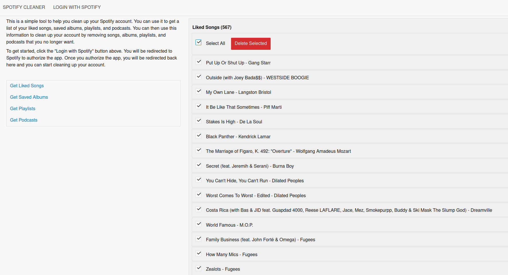

# spotify-cleaner

Spotify doesn't provide any way (as yet) to batch delete things.

This is a simple tool to help you clean up your Spotify account. You can use it to get a list of your liked songs, saved albums, playlists, and podcasts. You can then use this information to clean up your account by removing songs, albums, playlists, and podcasts that you no longer want.

## How to use
- [Set up a Spotify app to use the API](https://developer.spotify.com/documentation/web-api)
- Copy the Client ID and Client Secret (required in `main.py`)
- Install dependencies (uses [Poetry](https://python-poetry.org/))
- Run `main.py`

## TODO
- Token refresh
- Improve error handling
