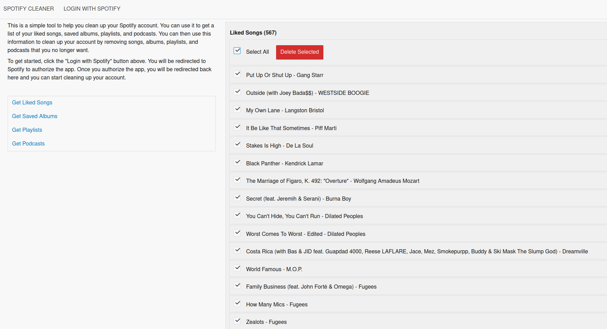

# spotify-cleaner



Spotify doesn't provide any way (as yet) to batch delete things.

This is a simple tool to help you clean up your Spotify account. You can use it to get a list of your liked songs, saved albums, playlists, and podcasts. You can then use this information to clean up your account by removing songs, albums, playlists, and podcasts that you no longer want.

## How to use
- [Set up a Spotify app to use the API](https://developer.spotify.com/documentation/web-api)
  - In the app settings, add `http://127.0.0.1:8080/callback` as a Redirect URI. 
  - Use Web API as scope. 
- Copy the Client ID and Client Secret and set them as environment variables (see [Configuration](#configuration) below)
- Install dependencies (uses [Poetry](https://python-poetry.org/))

```
python3 -m venv .venv
source .venv/bin/activate
pip install bottle requests
```

- Run `main.py`

## Configuration
App settings (scopes, redirect URI, API base URL, batch limits) live in [`config.py`](./config.py), not `main.py`. `config.py` contains no secrets itself — it reads your Spotify credentials from environment variables at startup and exits with an error if they're missing:

- `SPOTIFY_CLIENT_ID`
- `SPOTIFY_CLIENT_SECRET`

The easiest way to set these is via a `.env` file, which `config.py` loads automatically on startup (no extra dependency, no need to `source` it yourself):

```bash
cp .env.example .env
# edit .env with your Client ID/Secret
python main.py
```

`.env` is excluded via `.gitignore`, so your secrets never get committed. Real environment variables (e.g. `export SPOTIFY_CLIENT_ID=...`) still take priority over `.env` if both are set.

## TODO
- Token refresh
- Improve error handling
